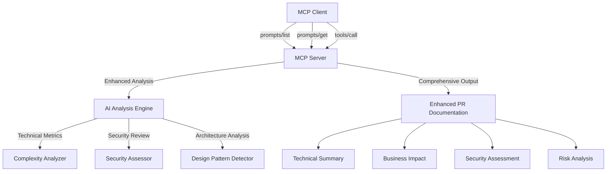

# 🚀 MCP Server for AI-Powered Pull Request Generation

A powerful Model Context Protocol (MCP) server that enhances your development workflow by generating comprehensive, professional pull request documentation using AI analysis.

## ✨ Enhanced Features

### 🎯 **MCP Prompts Integration**

Leverage standardized prompt templates for comprehensive PR workflows:

#### **Available Prompts:**

1. **`analyze_changes`** - Comprehensive Git Change Analysis

   - Analyzes git changes with detailed technical metrics
   - Provides architectural impact assessment
   - Includes security and compliance review
   - Generates file-by-file analysis with recommendations

2. **`generate_comprehensive_pr`** - Enterprise-Grade PR Documentation

   - Creates detailed pull request documentation
   - Optional security analysis and technical metrics
   - Includes testing strategy and deployment considerations
   - Provides review guidelines for stakeholders

3. **`code_review_checklist`** - Dynamic Code Review Checklists
   - Generates project-specific review checklists
   - Configurable focus areas (security, performance, maintainability, testing)
   - Includes architecture and design considerations
   - Provides deployment and operations guidelines

#### **Using MCP Prompts:**

**In Claude Desktop or Cursor IDE:**

```
/analyze_changes project_path="/path/to/repo" target_branch="main"
```

**In MCP-compatible clients:**

```javascript
// List available prompts
const prompts = await client.request("prompts/list");

// Get specific prompt
const analysisPrompt = await client.request("prompts/get", {
  name: "analyze_changes",
  arguments: {
    project_path: "/path/to/repo",
    target_branch: "main",
    base_branch: "develop",
  },
});
```

### 🛠️ **Tool Integration**

Direct AI-powered PR generation tool:

```javascript
// Generate comprehensive PR
const result = await client.request("tools/call", {
  name: "generate_ai_pr",
  arguments: {
    title: "feat: implement user authentication system",
    description: "Add OAuth 2.0 support with JWT tokens",
    rootUri: "file:///path/to/project",
  },
});
```

## 🎯 Key Capabilities

### 📊 **Enhanced Technical Analysis**

- **Code Complexity Assessment**: Automatic complexity scoring and metrics
- **Security Compliance Review**: Authentication, authorization, and data protection analysis
- **Dependency Impact Analysis**: Cross-component dependency mapping and integration assessment
- **Risk Assessment**: Breaking changes, deployment considerations, and testing recommendations

### 🏗️ **Architectural Insights**

- **Design Pattern Analysis**: Identification of pattern implementations and modifications
- **Component Relationship Mapping**: System boundary analysis and scalability implications
- **Technical Debt Assessment**: Maintainability metrics and technical debt implications
- **Performance Impact Evaluation**: Computational complexity and scalability considerations

### 🔒 **Security-First Approach**

- **Authentication Flow Analysis**: Security model impact assessment
- **Data Protection Review**: Privacy considerations and data handling analysis
- **Vulnerability Assessment**: Input validation, sanitization, and attack vector analysis
- **Compliance Mapping**: Audit trail requirements and regulatory considerations

### 📁 **Granular File Analysis**

- **Per-File Impact Assessment**: Individual file complexity and business impact scoring
- **Change Classification**: Addition/Modification/Deletion categorization
- **Business Logic Deep Dive**: Rule changes, validation logic, and workflow modifications
- **Technical Recommendations**: Specific, actionable improvement suggestions

## 🏗️ **Architecture**

The enhanced MCP server provides a comprehensive PR generation ecosystem:



## 📚 **Usage Examples**

### **Comprehensive Project Analysis**

```bash
# Analyze current changes with full security and technical metrics
/analyze_changes project_path="." target_branch="main"

# Generate enterprise-grade PR with security analysis
/generate_comprehensive_pr title="Security Enhancement" description="Implement 2FA" project_path="." include_security_analysis=true include_technical_metrics=true

# Create focused code review checklist
/code_review_checklist project_path="." focus_areas="security,performance"
```

### **Enterprise Workflow Integration**

**For Security-Critical Changes:**

1. Use `analyze_changes` for comprehensive security assessment
2. Generate `code_review_checklist` with security focus
3. Create `generate_comprehensive_pr` with security analysis enabled

**For Architecture Changes:**

1. Run `analyze_changes` for architectural impact assessment
2. Use `generate_comprehensive_pr` with technical metrics
3. Generate focused review checklist for architecture and design

## 🔧 **Setup & Configuration**

### **Claude Desktop Integration**

Add to your `claude_desktop_config.json`:

```json
{
  "mcpServers": {
    "generate-pr-mcp": {
      "command": "npx",
      "args": ["-y", "@your-org/generate-pr-mcp"],
      "env": {}
    }
  }
}
```

### **Cursor IDE Integration**

The MCP server automatically integrates with Cursor's built-in AI capabilities:

1. Install the package: `npm install -g @your-org/generate-pr-mcp`
2. Configure in Cursor's MCP settings
3. Access via slash commands: `/analyze_changes`, `/generate_comprehensive_pr`

## 🎨 **Professional Output Examples**

### **Enhanced PR Template Structure:**

```markdown
# 🎯 PR Title: feat: implement comprehensive user authentication system

## 📋 Executive Summary

Professional summary with business context and technical overview...

## 🔑 Technical Implementation Details

Detailed technical analysis with code examples and architectural decisions...

## 💼 Business Logic Impact Analysis

Comprehensive analysis of business rule changes and user workflow impact...

## 🏗️ Architectural Changes & Design Impact

System design modifications with component relationship analysis...

## 🔍 Technical Complexity Analysis

Complexity metrics, maintainability assessment, and performance implications...

## 🔒 Security & Compliance Assessment

Authentication/authorization analysis, data protection review, compliance mapping...

## 📊 Dependency & Integration Impact

External dependency changes, API contract modifications, migration requirements...

## ⚠️ Risk Assessment & Recommendations

Breaking changes analysis, deployment considerations, testing strategies...

## 📁 Detailed File Analysis

File-by-file impact assessment with technical recommendations...

## 🧪 Testing & Quality Assurance

Comprehensive testing strategy with coverage recommendations...

## 🚀 Deployment & Operations

Infrastructure requirements, monitoring needs, rollback procedures...
```

## 🌟 **Benefits**

### **For Development Teams:**

- ⚡ **10x Faster PR Creation**: Automated comprehensive documentation
- 🎯 **Consistent Quality**: Standardized analysis and documentation format
- 🔍 **Thorough Review Guidance**: Detailed checklists and recommendations
- 📊 **Data-Driven Insights**: Technical metrics and complexity analysis

### **For Enterprise Environments:**

- 🔒 **Security-First Approach**: Comprehensive security and compliance assessment
- 📋 **Audit Trail Compliance**: Detailed documentation for regulatory requirements
- 🏗️ **Architectural Governance**: Design pattern analysis and technical debt assessment
- 👥 **Stakeholder Communication**: Multi-audience documentation with business context

### **For Code Quality:**

- 🧪 **Testing Excellence**: Comprehensive testing strategy recommendations
- ⚡ **Performance Optimization**: Performance impact analysis and recommendations
- 🔧 **Maintainability Focus**: Technical debt assessment and maintainability metrics
- 📚 **Knowledge Transfer**: Detailed technical documentation for team knowledge sharing

## 🤝 **Contributing**

We welcome contributions! Please see our [Contributing Guide](CONTRIBUTING.md) for details.

## 📄 **License**

This project is licensed under the MIT License - see the [LICENSE](LICENSE) file for details.

## 🔗 **Related Resources**

- [Model Context Protocol Documentation](https://modelcontextprotocol.io/docs/concepts/prompts)
- [Claude Desktop Setup Guide](CLAUDE_DESKTOP_SETUP.md)
- [Cursor IDE MCP Integration](https://docs.cursor.com/mcp)
- [Enterprise Deployment Guide](docs/enterprise-deployment.md)

---

**Made with ❤️ for developers who value comprehensive, professional PR documentation**
