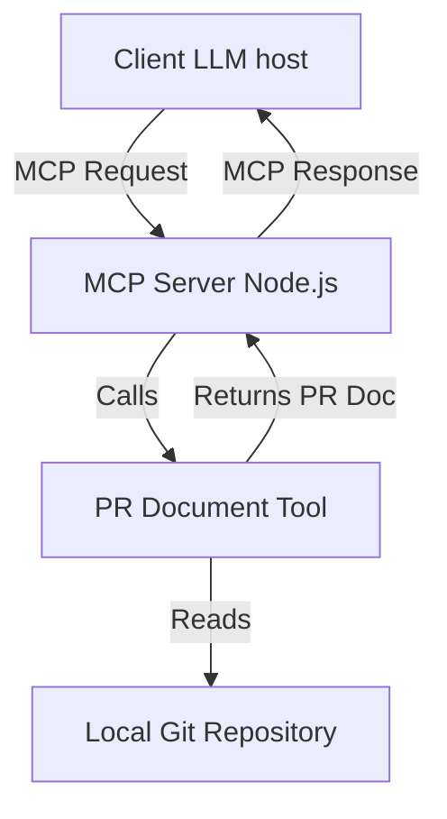
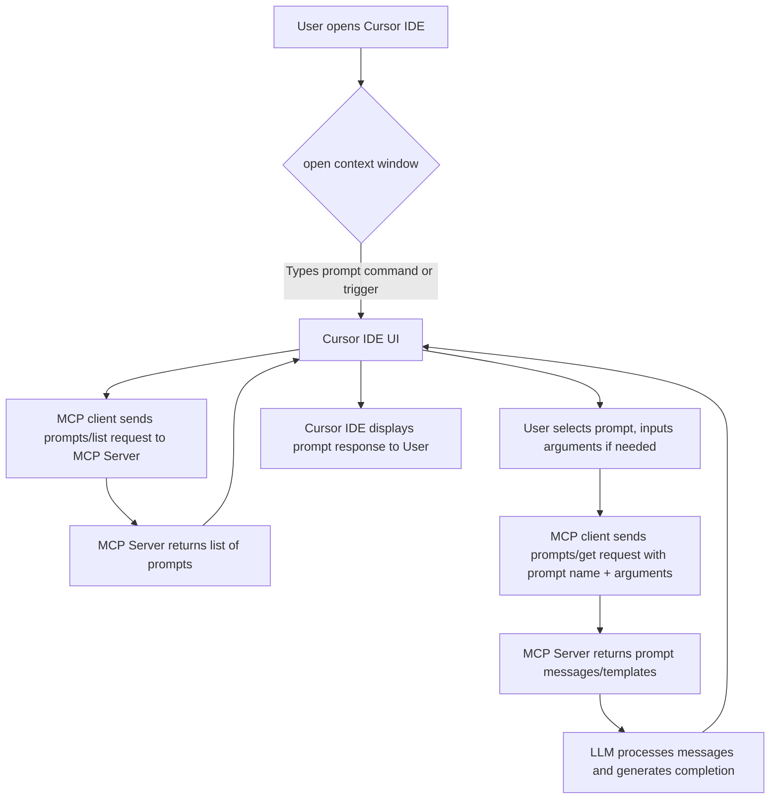

# Quick PR Flow

## Flow

```mermaid
flowchart TD
    A[Client LLM host] -- MCP Request --> B[MCP Server Node.js]
    B -- Calls --> C[PR Document Tool]
    C -- Reads --> D[Local Git Repository]
    C -- Returns PR Doc --> B
    B -- MCP Response --> A
```

## User Flow

```mermaid
flowchart TD
    U[User opens Cursor IDE] --> C{ open context window }
    C -->|Types prompt command or trigger| P[Cursor IDE UI]
    P --> R1[MCP client sends prompts/list request to MCP Server]
    R1 --> S1[MCP Server returns list of prompts]
    S1 --> P
    P --> U2[User selects prompt, inputs arguments if needed]
    U2 --> R2[MCP client sends prompts/get request with prompt name + arguments]
    R2 --> S2[MCP Server returns prompt messages/templates]
    S2 --> LLM[LLM processes messages and generates completion]
    LLM --> P
    P --> U3[Cursor IDE displays prompt response to User]
```
